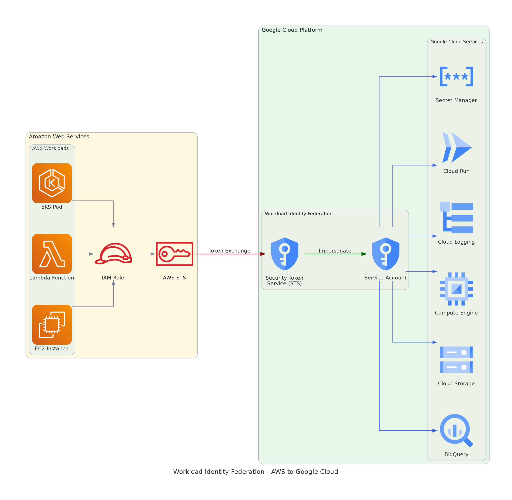
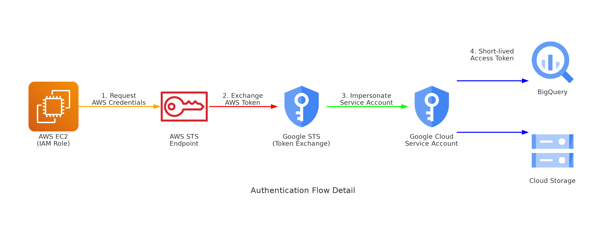
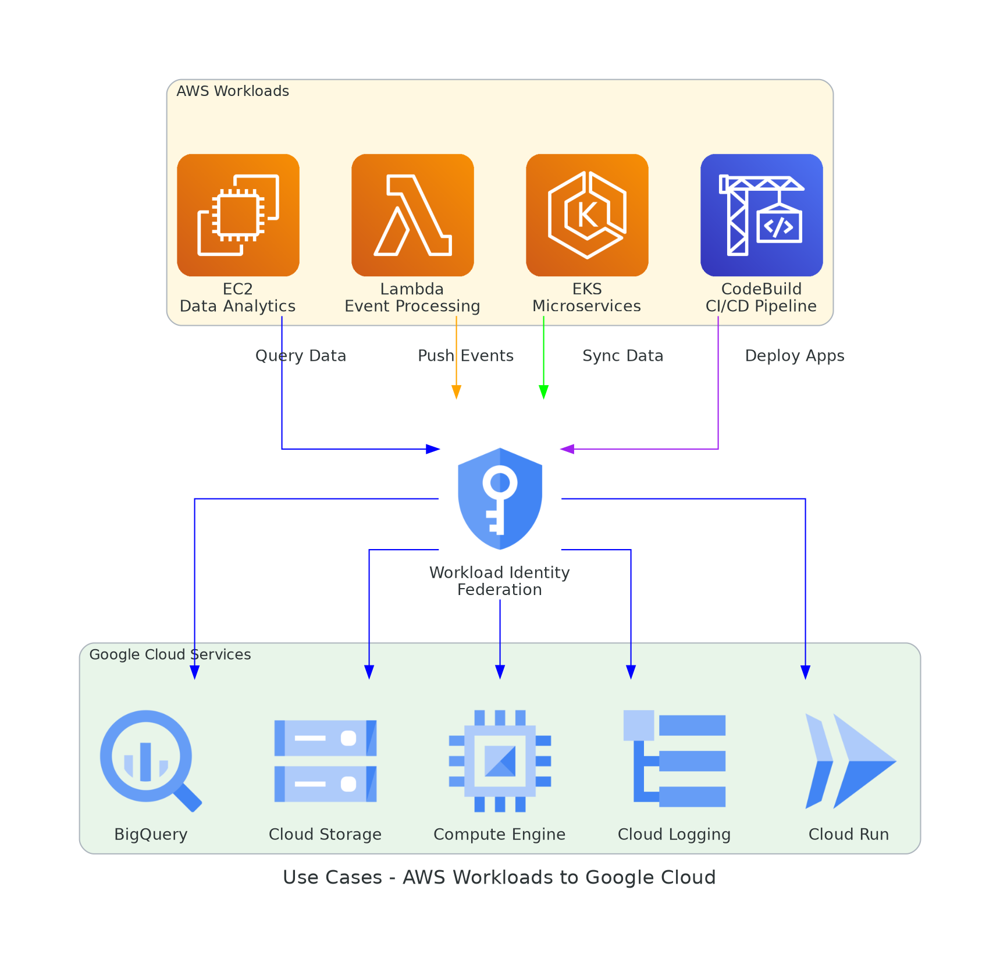

# AWS to Google Cloud: Workload Identity Federation Guide

A comprehensive, step-by-step guide to configure **Google Cloud Workload Identity Federation** for AWS workloads — enabling secure, keyless authentication from AWS to Google Cloud services.

## Why Workload Identity Federation?

| Criteria | Service Account Key | Workload Identity Federation |
|----------|--------------------|-----------------------------|
| Secret storage | JSON key file must be secured | No secrets to store |
| Key rotation | Manual, error-prone | Automatic — tokens expire in 1 hour |
| Leak risk | High — keys can leak via git, logs, backups | Nothing to leak |
| Audit trail | Only identifies the Service Account | Traces back to the original AWS identity (ARN) |
| Compliance | Fails many security standards | Aligns with Zero Trust, SOC2, ISO 27001 |

## Architecture



## Authentication Flow



1. AWS workload obtains STS token from Instance Metadata Service (EC2), Execution Role (Lambda), or IRSA (EKS).
2. Google Security Token Service receives the AWS token and verifies it by calling back to the AWS STS endpoint.
3. Upon successful verification, Google STS issues a short-lived Federated Token.
4. The Federated Token is used to impersonate a pre-configured Google Cloud Service Account.
5. A Service Account Access Token (1-hour TTL) is issued to call Google Cloud APIs.

## Cost

| Component | Cost |
|-----------|------|
| Workload Identity Pool & Provider | Free |
| Token exchange (STS API) | Free |
| Service Account impersonation | Free |
| Credential configuration file | Free |
| AWS IAM Role & STS calls | Free |

The only costs come from the Google Cloud services you access (BigQuery, Cloud Storage, etc.), which have their own free tiers.

## Supported Use Cases



| # | Use Case | AWS Source | GCP Target | Required Role |
|---|----------|-----------|------------|---------------|
| 1 | Data analytics | EC2 | BigQuery | bigquery.dataViewer + bigquery.jobUser |
| 2 | Data sync & backup | EC2 | Cloud Storage | storage.objectAdmin |
| 3 | Cross-cloud inventory | EC2 | Compute Engine | compute.viewer |
| 4 | Infrastructure as Code | EC2 / CodeBuild | Terraform resources | Varies by resource |
| 5 | Centralized logging | EC2 | Cloud Logging | logging.logWriter |
| 6 | Event processing | Lambda | BigQuery / GCS | bigquery.dataEditor |
| 7 | Microservices | EKS Pod | Any GCP service | Varies |
| 8 | CI/CD deployment | CodeBuild | Cloud Run / GKE | run.admin |

---

## Prerequisites

- AWS Account with IAM admin access
- AWS workload with an assigned IAM Role (EC2 Instance Profile, Lambda Execution Role, or EKS IRSA)
- Google Cloud Project with billing enabled
- IAM Admin + Service Account Admin permissions on the GCP project
- gcloud CLI v363.0.0+

---

## Step-by-Step Setup

### Step 1: Gather AWS Identity Information

SSH into your AWS workload and run:

```bash
aws sts get-caller-identity
```

Sample output:

```json
{
    "UserId": "AROAXXXXXXXXXXXXXXXXX:i-0xxxxxxxxxxxxxxxxxx",
    "Account": "XXXXXXXXXXXX",
    "Arn": "arn:aws:sts::XXXXXXXXXXXX:assumed-role/<ROLE_NAME>/i-0xxxxxxxxxxxxxxxxxx"
}
```

Note down: **Account ID**, **Role Name**, and **Full ARN**.

### Step 2: Enable Google Cloud APIs

```bash
gcloud services enable \
  iam.googleapis.com \
  sts.googleapis.com \
  iamcredentials.googleapis.com \
  bigquery.googleapis.com \
  storage.googleapis.com \
  logging.googleapis.com \
  --project=<PROJECT_ID>
```

### Step 3: Create Workload Identity Pool

```bash
gcloud iam workload-identity-pools create <POOL_ID> \
  --project=<PROJECT_ID> \
  --location=global \
  --display-name="AWS Pool"
```

### Step 4: Create AWS Provider

```bash
gcloud iam workload-identity-pools providers create-aws <PROVIDER_ID> \
  --project=<PROJECT_ID> \
  --location=global \
  --workload-identity-pool=<POOL_ID> \
  --account-id=<AWS_ACCOUNT_ID> \
  --attribute-mapping="google.subject=assertion.arn"
```

### Step 5: Create Service Account

```bash
gcloud iam service-accounts create <SA_NAME> \
  --project=<PROJECT_ID> \
  --display-name="AWS Workload SA"
```

### Step 6: Grant Impersonation Permissions

```bash
MEMBER="principal://iam.googleapis.com/projects/<PROJECT_NUMBER>/locations/global/workloadIdentityPools/<POOL_ID>/subject/<FULL_AWS_ARN>"

# Both roles are required
gcloud iam service-accounts add-iam-policy-binding \
  <SA_NAME>@<PROJECT_ID>.iam.gserviceaccount.com \
  --role=roles/iam.workloadIdentityUser \
  --member="${MEMBER}"

gcloud iam service-accounts add-iam-policy-binding \
  <SA_NAME>@<PROJECT_ID>.iam.gserviceaccount.com \
  --role=roles/iam.serviceAccountTokenCreator \
  --member="${MEMBER}"
```

Important notes:
- Use **PROJECT_NUMBER** (numeric), not Project ID
- The **FULL_AWS_ARN** must match exactly, including the instance/resource ID
- Wait 30-60 seconds for IAM policy propagation

### Step 7: Grant GCP Service Permissions

```bash
gcloud projects add-iam-policy-binding <PROJECT_ID> \
  --role=<ROLE> \
  --member="serviceAccount:<SA_NAME>@<PROJECT_ID>.iam.gserviceaccount.com"
```

### Step 8: Generate Credential Configuration

```bash
gcloud iam workload-identity-pools create-cred-config \
  projects/<PROJECT_NUMBER>/locations/global/workloadIdentityPools/<POOL_ID>/providers/<PROVIDER_ID> \
  --service-account=<SA_NAME>@<PROJECT_ID>.iam.gserviceaccount.com \
  --aws \
  --enable-imdsv2 \
  --output-file=gcp-credentials.json
```

This file contains **no secrets** — safe to store in version control.

### Step 9: Configure AWS Workload

```bash
export GOOGLE_APPLICATION_CREDENTIALS=/path/to/gcp-credentials.json
```

---

## Verified Examples

### BigQuery Query

```python
from google.cloud import bigquery

client = bigquery.Client(project="<PROJECT_ID>")

query = """
SELECT corpus, COUNT(*) as word_count
FROM `bigquery-public-data.samples.shakespeare`
GROUP BY corpus ORDER BY word_count DESC LIMIT 5
"""
for row in client.query(query).result():
    print(f"  {row.corpus}: {row.word_count}")
```

Actual output from AWS EC2:

```
Top 5 Shakespeare works by word count:
  hamlet: 5318
  kinghenryv: 5104
  cymbeline: 4875
  troilusandcressida: 4795
  kinglear: 4784
```

### Cloud Storage

```python
from google.cloud import storage

client = storage.Client(project="<PROJECT_ID>")
bucket = client.bucket("<BUCKET_NAME>")

blob = bucket.blob("test/hello.txt")
blob.upload_from_string("Hello from AWS EC2 via Workload Identity Federation!")

content = bucket.blob("test/hello.txt").download_as_text()
print(content)
```

### Cloud Logging

```python
from google.cloud import logging as cloud_logging
import socket, datetime

client = cloud_logging.Client(project="<PROJECT_ID>")
logger = client.logger("aws-application")

logger.log_struct({
    "severity": "INFO",
    "message": "Application started",
    "hostname": socket.gethostname(),
    "source": "aws-ec2"
})
```

Actual output from AWS EC2:

```
Log sent to GCP Cloud Logging successfully!
  Logger: aws-wif-test
  Hostname: ip-172-31-xx-xxx
  Timestamp: 2026-03-29T06:34:55.402882
```

### Lambda Function

```python
import os, json

def lambda_handler(event, context):
    os.environ["GOOGLE_APPLICATION_CREDENTIALS"] = "/var/task/gcp-credentials.json"
    from google.cloud import bigquery
    client = bigquery.Client(project="<PROJECT_ID>")
    rows = [{"event_source": event.get("source"), "detail": json.dumps(event)}]
    client.insert_rows_json("<PROJECT_ID>.events.lambda_events", rows)
    return {"statusCode": 200}
```

### Terraform from AWS

```hcl
provider "google" {
  project = "<PROJECT_ID>"
  region  = "us-central1"
}

resource "google_bigquery_dataset" "analytics" {
  dataset_id = "cross_cloud_analytics"
  location   = "US"
}

resource "google_storage_bucket" "backups" {
  name     = "<PROJECT_ID>-backups"
  location = "US"
  lifecycle_rule {
    condition { age = 90 }
    action { type = "Delete" }
  }
}
```

```bash
export GOOGLE_APPLICATION_CREDENTIALS=/path/to/gcp-credentials.json
terraform init && terraform apply
```

---

## Troubleshooting

| Error | Cause | Fix |
|-------|-------|-----|
| Permission iam.serviceAccounts.getAccessToken denied | Missing serviceAccountTokenCreator role | Grant roles/iam.serviceAccountTokenCreator, wait 60s |
| Unable to retrieve AWS region from metadata service | No IAM Role or IMDS disabled | Verify with `aws sts get-caller-identity`; for IMDSv1 remove --enable-imdsv2 |
| The caller does not have permission | SA missing role for target service | Grant the appropriate role per Step 7 |
| Subject mismatch | ARN in binding doesn't match actual ARN | Check actual ARN; note Instance ID changes on replacement |
| Lambda: Could not connect to metadata service | Lambda doesn't use EC2 IMDS | Ensure gcp-credentials.json is bundled in deployment package |

---

## References

- [Workload Identity Federation with AWS](https://cloud.google.com/iam/docs/workload-identity-federation-with-other-clouds)
- [Best Practices for Workload Identity Federation](https://cloud.google.com/iam/docs/best-practices-for-using-workload-identity-federation)
- [Workload Identity Federation with Kubernetes](https://cloud.google.com/iam/docs/workload-identity-federation-with-kubernetes)
- [AWS IAM Roles for EC2](https://docs.aws.amazon.com/AWSEC2/latest/UserGuide/iam-roles-for-amazon-ec2.html)
- [Terraform Google Cloud Provider](https://registry.terraform.io/providers/hashicorp/google/latest/docs)

---

## License

This project is licensed under the MIT License - see the [LICENSE](LICENSE) file for details.

---

## Verified Test Results

The following end-to-end test was performed on 2026-03-29, authenticating from an AWS EC2 instance to Google Cloud BigQuery via Workload Identity Federation.

### Test Environment

| Component | Detail |
|-----------|--------|
| AWS Identity | EC2 Instance Role (via Instance Metadata Service v2) |
| GCP Project | Lab environment |
| WIF Pool | aws-pool |
| WIF Provider | aws-provider |
| GCP Service Account | aws-bigquery-sa |
| Target Service | BigQuery |

### Test Output

```
$ python3 bigquery_example.py

Connected to BigQuery via AWS Workload Identity Federation!
Test query (Shakespeare word count): 164656

AWS EC2 -> GCP BigQuery: SUCCESS!
```

### Authentication Flow Verified

```
AWS EC2 Instance Metadata (IAM Role credentials)
    |
    v  Token Exchange (SigV4 -> Federated Token)
Google STS
    |
    v  Impersonate
GCP Service Account (access token)
    |
    v  Query
BigQuery (164656 rows counted)
```
